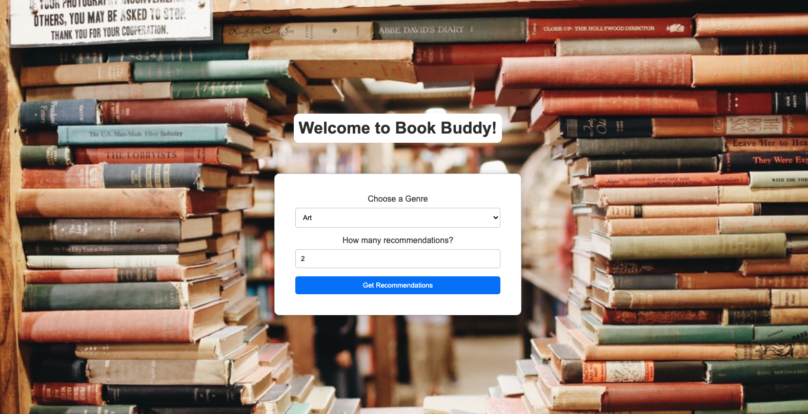
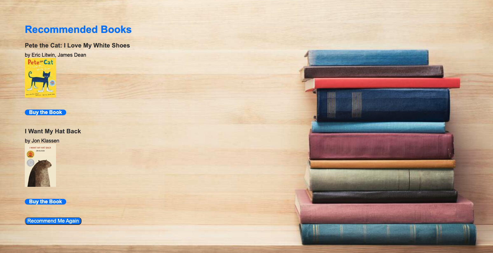
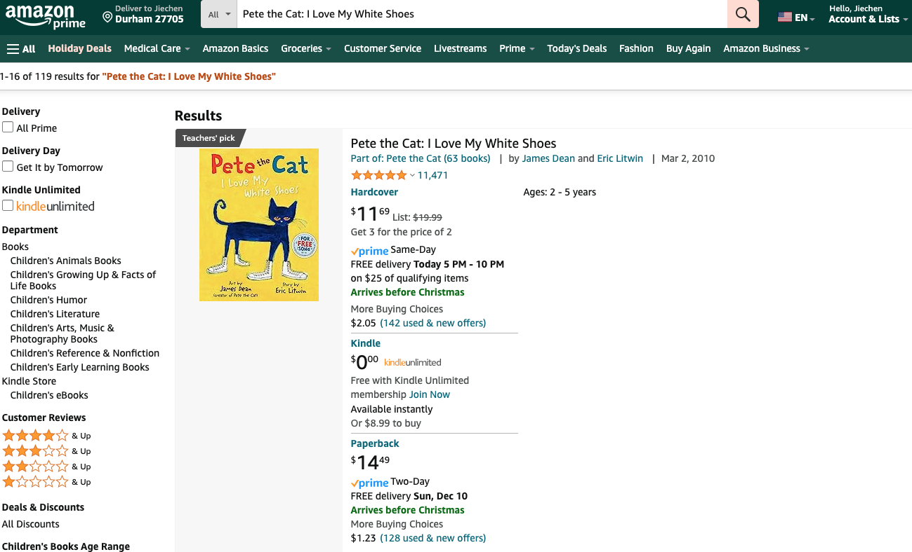
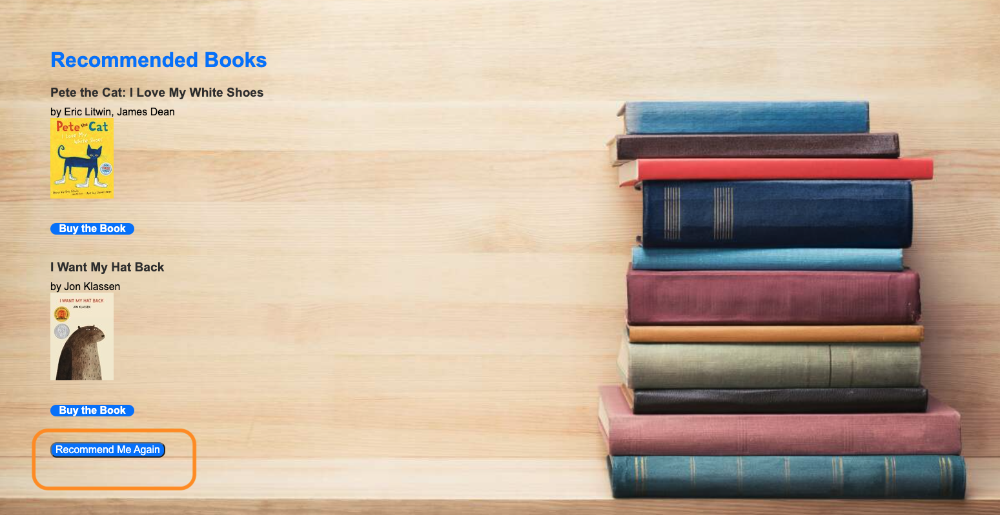
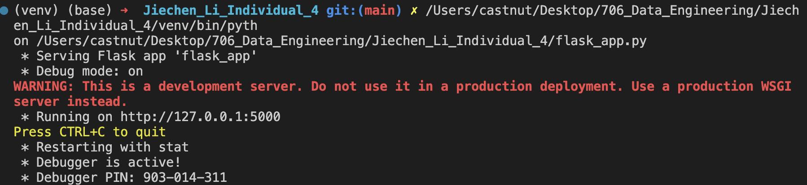
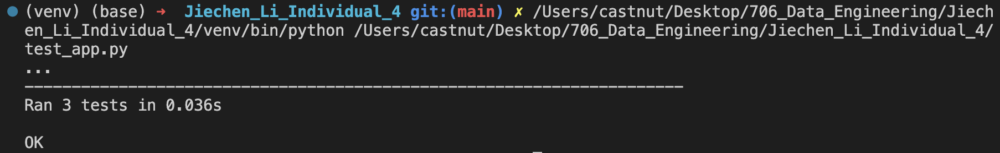
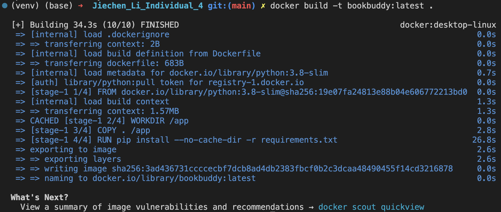
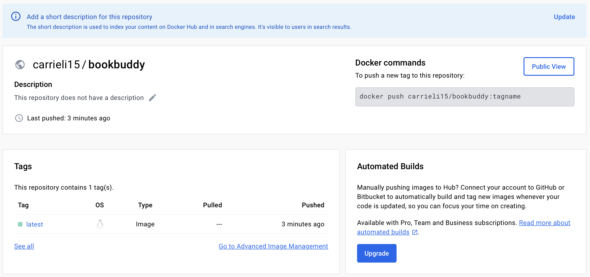
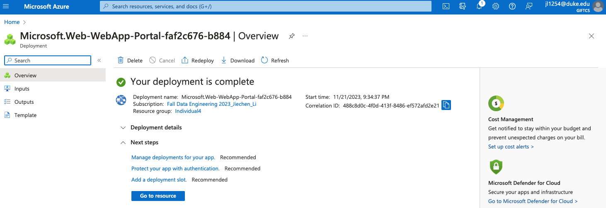
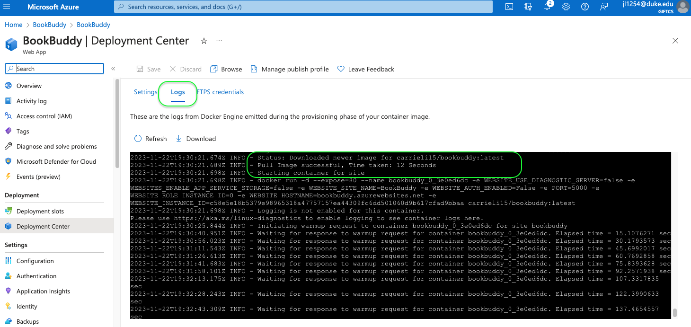

[](https://github.com/nogibjj/Jiechen_Li_Individual_4/actions/workflows/cicd.yml)

# Jiechen_Li_Individual_4

## Book Buddy

Are you a book lover with a taste for surprises? Discover the joy of unexpected reads with Book Buddy's Mystery Box! Tailored just for you, our unique book recommendation system brings the thrill of mystery to your reading list. Dive into a world of hidden gems and delightful discoveries – your next favorite book awaits!

## Purpose

* Build a publicly accessible auto-scaling container using Azure App Services and Flask.
* Enables the Flask App to run in a Docker Container.
* Hosting functioning container on DockerHub.
* Deploying container via Azure Web App to a public endpoint.

## Dataset

The dataset is selected from [Kaggle](https://www.kaggle.com/datasets/jealousleopard/goodreadsbooks) as a good clean dataset of books. The dataset contains the detailed information about the books and authors, primarily. Detailed description for each column can be found alongside.

## Flask App Guidance on Local IDE

### Install it in Python Environment

```command line
pip install Flask
```

### Create ``flask_app.py`` file

We name our App as "BookBuddy", which is a book recommemdation system.

```python
from flask import Flask, jsonify, request
import pandas as pd

app = Flask(__name__)
books_df = pd.read_csv('books.csv')

@app.route('/')
def index():
    return "Welcome to BookBuddy!"
```

### Test ``flask_app.py`` file

```python
import unittest
from flask_app import app
import urllib.parse

class FlaskTestCase(unittest.TestCase):
    def setUp(self):
        self.app = app.test_client()
        self.app.testing = True

    def test_index(self):
        response = self.app.get("/")
        self.assertEqual(response.status_code, 200)
        self.assertIn(b"Welcome to BookBuddy!", response.data)
```

## Docker Guidance

### Write a Dockerfile

```Dockerfile
# Use an official Python runtime as a parent image
FROM python:3.8-slim

# Set the working directory in the container
WORKDIR /app

# Copy the current directory contents into the container at /app
COPY . /app

# Install any needed packages specified in requirements.txt
RUN pip install --no-cache-dir -r requirements.txt

# Make port 5000 available to the world outside this container
EXPOSE 5000

# Define environment variable
ENV NAME World

# Run flask_app.py when the container launches
CMD ["python", "flask_app.py"]
```

### Build Docker Image Locally

```Dockerfile
docker build -t bookbuddy:latest . 
```

Ensure we installed Docker Desktop in local, and have our tag name with lowercase

### Create a Repository on Docker Hub

Create a new repository named ``bookbuddy``, and push the Docker image.

```command line
docker login
docker tag bookbuddy:latest carrieli15/bookbuddy:latest
docker push carrieli15/bookbuddy:latest
```

## Azure Guidance

### Set Up Azure CLI

Install it from the offical website and configure it locally.

```command line
/bin/bash -c "$(curl -fsSL https://raw.githubusercontent.com/Homebrew/install/HEAD/install.sh)"

brew update && brew install azure-cli
```

### Create a Web App and Deploy

In the Web App's settings, we can find the section for deployment, often labeled as "Deployment Center". Choose the option to deploy a container from Docker Hub. Provide the details of our Docker image.

### Continuous Deployment

Azure can automatically redeploy our app whenever you update the Docker image on Docker Hub by chooing "On" for continuous deployment.

## Using Book Buddy

* Go to the following URL: [Book Buddy](https://bookbuddy3.azurewebsites.net/)
* Select the genre you are interested in
* Select how many books you would like to be recommended (Note: a value less than or equal to 0 will not let you continue)



* Click `Get Recommendations`. You will be redirected to a page with the list of books recommended in the genre selected.



* At this point, you can click on `Buy the Book`. This will rerouted you to an Amazon page to purchase the book.



* Alternatively, if you want to be recommended a new set of book or switch genres, click `Recommend Me Again`.



## Results

1. **Create Flask App of BookBuddy**
<br>  

2. **Test for Flask App of BookBuddy**
<br/>

3. **Docker Image Build for BookBuddy App**
<br/>

4. **Push Docker Image to Docker Hub**
<br/>

5. **Create Azure Web App**
<br/>

6. **Azure Logs Showing the Progress of the Deployment**
<br/>

## Demo Video

[Project Walkthrough Video](https://youtu.be/Fem9h7PipTI)

## Reference

Please click <a href="https://github.com/nogibjj/python-ruff-template">here</a> to see the template of this repo.
